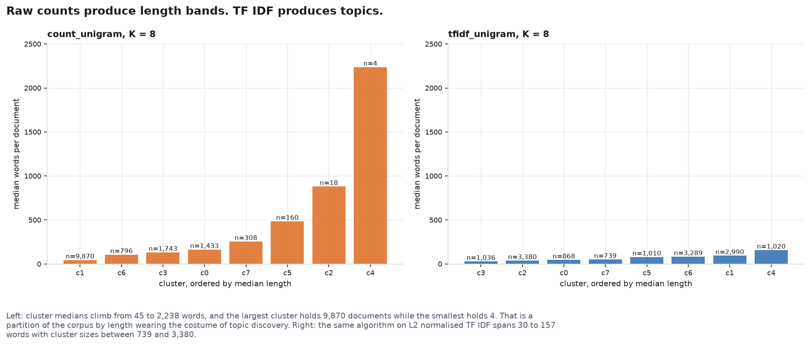
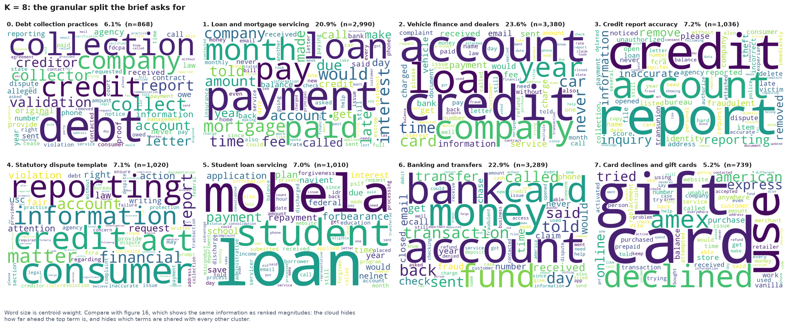
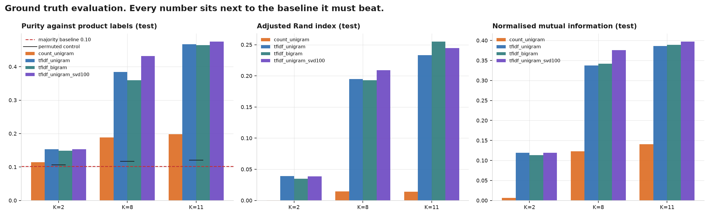
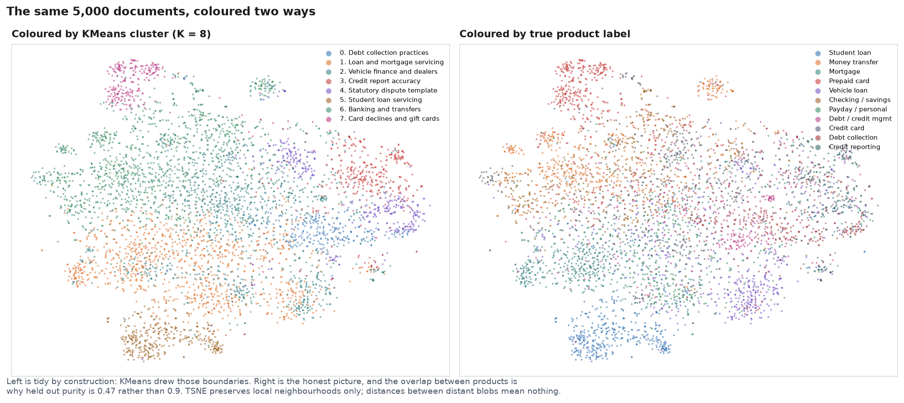

# Financial Complaint Topic Modelling

Unsupervised topic modelling over 17,915 consumer finance complaint narratives, using KMeans,
NMF and LDA on TF IDF and raw count features, evaluated against the product labels the Consumer
Financial Protection Bureau assigns by hand.

Most clustering projects end at "here are the clusters, they look sensible". This one has
ground truth, so every result is scored, and every score sits next to the baseline it has to
beat. The most useful finding is a negative one: **on this corpus the standard internal
validation metric recommends the worst model in the study.**

## Headline result

Held out test split, 3,583 documents never seen during fitting, scored against 11 product
classes:

<table>
<tr><th>Method</th><th>K</th><th>Purity</th><th>ARI</th><th>NMI</th></tr>
<tr><td><b>NMF on TF IDF</b></td><td>11</td><td>0.460</td><td><b>0.265</b></td><td>0.369</td></tr>
<tr><td><b>KMeans on TF IDF with SVD</b></td><td>11</td><td><b>0.475</b></td><td>0.245</td><td><b>0.397</b></td></tr>
<tr><td>KMeans on TF IDF</td><td>11</td><td>0.467</td><td>0.233</td><td>0.386</td></tr>
<tr><td>LDA on counts</td><td>11</td><td>0.351</td><td>0.141</td><td>0.275</td></tr>
<tr><td>KMeans on raw counts</td><td>11</td><td>0.198</td><td>0.014</td><td>0.141</td></tr>
<tr><td><i>Permuted control</i></td><td>11</td><td><i>0.123</i></td><td><i>0.000</i></td><td><i>0.000</i></td></tr>
<tr><td><i>Majority class baseline</i></td><td></td><td><i>0.102</i></td><td><i>0.000</i></td><td><i>0.000</i></td></tr>
</table>

**47.5 percent purity against a 10.2 percent majority baseline and a 12.3 percent permuted
control.** A 4.7 fold lift over guessing, from a method that never sees a single label while
fitting.

It is also not a solved problem, and saying so is part of the result: 52 percent of documents
sit in a cluster whose majority product is not their own. Section "What did not work" explains
why, and why that ceiling is a property of the data rather than of the tuning.

## Three findings

### 1. The validation metric was inverted

Silhouette is the standard way to choose K without labels. Across the twelve evaluated fits its
correlation with the truth is **negative**:

* silhouette against adjusted Rand index: **(0.590)**
* silhouette against normalised mutual information: **(0.651)**

The highest silhouette in the entire study, 0.474, belongs to a model with an adjusted Rand
index of exactly **0.000**, no better than shuffling. Selecting by silhouette here would not
have been slightly suboptimal, it would have been close to the worst available choice.

Negative numbers are shown in parentheses throughout this document.

### 2. Raw counts under Euclidean distance cluster by document length, not topic

Median narrative length varies by a factor of 2.2 across products, from 211 words for mortgage
complaints to 95 for debt collection. Raw count vectors have magnitude proportional to length,
and **74.8 percent of the pairwise Euclidean distance between them is explained by length
difference alone**. KMeans minimises exactly that distance.

The result is eight length bands wearing the costume of topic discovery. Cluster medians run
monotonically 45, 106, 132, 164, 255, 486, 881, 2,238 words, and the last cluster contains four
documents.



Same algorithm, same corpus, same K. Only the representation differs.

**The mechanism is not what it first appears.** LDA consumes the identical raw count matrix and
is completely immune, explaining 0.2 percent of length variance. It never measures distance: it
models each document as a mixture drawn from a Dirichlet, which normalises the document away by
construction. So the defect is not "raw counts are bad", it is raw counts **under Euclidean
distance**.

### 3. Over half of a naive sample is duplicate text

Credit repair firms file near identical Fair Credit Reporting Act dispute letters in bulk. In a
sample drawn to match the true arrival distribution, exact duplicates are 37.6 percent and the
near duplicate surplus is **55.2 percent**. One template group holds 1,195 documents.

Exact string matching catches under half of it, because the templates are paraphrases: two
groups differ only in "I understand the significance of eliminating any erroneous accounts"
against "I understand the importance of removing any incorrect accounts". MinHash over five word
shingles was required.

Collapsing them changes what the corpus is: **credit reporting falls from 72.9 percent to 46.7
percent**, taking the majority baseline down with it. The apparent dominance of that category is
substantially an artefact of bulk filing rather than a count of affected consumers.

## The data

**Consumer Financial Protection Bureau Consumer Complaint Database**, fetched from the public
API with no key or account. United States federal public domain.

<table>
<tr><th></th><th>Stratified</th><th>Natural</th></tr>
<tr><td>Fetched</td><td>19,979</td><td>20,000</td></tr>
<tr><td>After cleaning and deduplication</td><td>17,915</td><td>8,869</td></tr>
<tr><td>Retained</td><td>89.7%</td><td>44.3%</td></tr>
<tr><td>Vocabulary</td><td>21,033</td><td>14,160</td></tr>
<tr><td>Median tokens per document</td><td>66</td><td>55</td></tr>
<tr><td>Majority class</td><td>10.2%</td><td>46.7%</td></tr>
</table>

Two corpora are built deliberately. The stratified one caps each product at 115 narratives per
month so small categories are not drowned out. The natural one preserves the real arrival
distribution. Comparing them is how the effect of class imbalance is measured rather than
assumed. All modelling results above use the stratified corpus.

Window: September 2023 to December 2024, 16 months, 11 product categories. The start date is not
arbitrary. See "A bug worth reading about" below.

## The eight themes

KMeans at K = 8 on TF IDF, the granular split the brief called for:

<table>
<tr><th>Cluster</th><th>Theme</th><th>Share</th><th>Distinctive terms</th></tr>
<tr><td>2</td><td>Vehicle finance and dealers</td><td>23.6%</td><td>car, vehicle, repair, title, dealership</td></tr>
<tr><td>6</td><td>Banking and transfers</td><td>22.9%</td><td>bank, fund, transaction, transfer, deposit</td></tr>
<tr><td>1</td><td>Loan and mortgage servicing</td><td>20.9%</td><td>payment, mortgage, interest, late, escrow</td></tr>
<tr><td>3</td><td>Credit report accuracy</td><td>7.2%</td><td>inquiry, remove, inaccurate, identity, theft</td></tr>
<tr><td>4</td><td>Statutory dispute template</td><td>7.1%</td><td>consumer, act, violation, usc, fair, rights</td></tr>
<tr><td>5</td><td>Student loan servicing</td><td>7.0%</td><td>mohela, forbearance, repayment, school</td></tr>
<tr><td>0</td><td>Debt collection practices</td><td>6.1%</td><td>collector, validation, creditor, agency</td></tr>
<tr><td>7</td><td>Card declines and gift cards</td><td>5.2%</td><td>gift, amex, declined, express, purchase</td></tr>
</table>



Cluster 4 is the most interesting of these. It is the credit repair industry's statutory
boilerplate, and it is **not** a product category: consumers use the template to dispute any
account type, so it spreads across vehicle loans, credit reporting and debt collection roughly
evenly. The clustering isolated a document register that the official taxonomy has no way to
express.

## Results in detail

Held out test split, product labels, all representations:

<table>
<tr><th>Representation</th><th>K</th><th>Purity</th><th>Permuted</th><th>ARI</th><th>NMI</th></tr>
<tr><td>TF IDF with SVD to 100</td><td>11</td><td>0.475</td><td>0.123</td><td>0.245</td><td>0.397</td></tr>
<tr><td>TF IDF unigram</td><td>11</td><td>0.467</td><td>0.123</td><td>0.233</td><td>0.386</td></tr>
<tr><td>TF IDF with bigrams</td><td>11</td><td>0.464</td><td>0.123</td><td>0.255</td><td>0.389</td></tr>
<tr><td>TF IDF with SVD to 100</td><td>8</td><td>0.432</td><td>0.119</td><td>0.209</td><td>0.376</td></tr>
<tr><td>TF IDF unigram</td><td>8</td><td>0.384</td><td>0.119</td><td>0.195</td><td>0.337</td></tr>
<tr><td>Raw counts</td><td>8</td><td>0.188</td><td>0.112</td><td>0.014</td><td>0.123</td></tr>
<tr><td>TF IDF unigram</td><td>2</td><td>0.153</td><td>0.107</td><td>0.039</td><td>0.119</td></tr>
<tr><td>Raw counts</td><td>2</td><td>0.114</td><td>0.105</td><td>0.000</td><td>0.007</td></tr>
</table>

**No generalisation gap.** Test scores are marginally higher than train in most configurations.
The vectoriser and the centroids were fit on 14,332 training documents alone and applied
unchanged to 3,583 unseen ones.

**K = 11 beats K = 8 beats K = 2** on every metric and every representation, with no sign of the
curve turning over by 11.

**The representation mattered roughly an order of magnitude more than the algorithm.** KMeans on
TF IDF against KMeans on counts is a factor of about 14 on ARI. KMeans against NMF is nil.



## What did not work

### The sentiment layer

The plan was to report theme from clustering and emotional intensity from VADER. **VADER does
not work on this corpus.** Every document is a complaint filed with a federal regulator, yet it
scores 45.1 percent of them positive, with a corpus mean of (0.042).

What it measures is register, not grievance:

* The highest scoring complaint in the corpus, at the maximum +1.000, is a hostile legal
  accusation opening "The creditor as fiduciary reached good faith and fair dealings...". VADER
  sees "good faith" and "fair dealings".
* Templated filings average +0.058 against (0.044) for unique ones, because credit repair
  boilerplate is polite.
* Ranking the eight themes by VADER score is almost exactly ranking them by formality.

VADER is a lexicon tuned on social media, where intensity is carried by punctuation, capitals
and emoji. A calm chronological account of losing four thousand dollars contains no negative
words and is devastating. No threshold tuning fixes that.

### Company name recognition

Roughly **one in four distinctive cluster terms is a company name** (mohela, amex, carvana,
chase), and mutual information with company is 71 to 78 percent of mutual information with
product.

The necessary control: product and company are already coupled at NMI 0.425 across 1,064
companies, because a mortgage servicer only generates mortgage complaints. So these numbers
**cannot** separate "learned the topic" from "learned the firm". What can be said is that a
substantial minority of the signal is proper nouns. For routing a complaint to a department that
is fine. For discovering what consumers are unhappy about it is a shortcut that would break on
any unseen firm.

### The ceiling on the method itself

Two clusters are nearly perfect: student loan 97.8 percent, prepaid card 97.2 percent. Both have
vocabulary nobody uses about anything else.

Two clusters holding 47 percent of the corpus are generic grievance language: money, bank,
account, charged, told, called. Someone describing an unauthorised charge uses much the same
words whether the instrument was a credit card, a checking account or a money transfer. The
product label distinguishes them; the narrative often does not.



The left panel is tidy by construction and proves nothing, since KMeans drew those boundaries.
The right panel is the honest picture, and the continuous smear at its centre is the 47.5
percent ceiling in visual form.

### Things carried over from the reference solution that turned out to be inert

* **`max_df=0.7`** removes **zero terms** here. The most widespread term after stopword removal
  appears in 52.2 percent of documents. A CountVectorizer at 1.0 and one at 0.7 produce a byte
  identical matrix. The parameter does real work on a single company tweet corpus and nothing on
  eleven products from hundreds of firms.
* **ASCII filtering**, written for multilingual tweets, is unnecessary: this corpus contains zero
  non ASCII characters.
* **Bigrams** cost 6.8 times the features and 3.6 times the runtime for no visible gain.

## A bug worth reading about

The first full corpus came back 2,735 rows under its ceiling. The cause is the most transferable
lesson in the project.

**The bureau renamed its product categories in August 2023.** Nine categories before, eleven
after. Querying a current category name against an earlier month does not raise an error, it
**matches nothing and returns an empty result**. Five of eleven categories silently had zero rows
for seven months while the six whose names never changed had full coverage.

The corpus looked fine and was quietly malformed: one dataset containing two incompatible
labelling schemes with a seven month hole in five of its classes. Time series plots would have
shown a dramatic cliff that was pure artefact, and the labels used to score everything would
have been broken.

The fix was to narrow the window to the period cleanly on one scheme, trading seven months of
data for uncontaminated ground truth. Mapping the old scheme forward was rejected because one
old category splits into two new ones, so recovering it means inferring labels the clustering is
then scored against.

**A filter that matches nothing returns an empty set, not an error.** Any pipeline filtering on a
categorical value needs to assert the value exists in the data, because the failure mode is a
quiet hole rather than a crash.

## Reproducing it

Requires macOS or Linux with Python 3.12. Full detail in [docs/SETUP.md](docs/SETUP.md).

```bash
git clone https://github.com/matthewpeters-extended/K-Means-Cluster-Modeling.git
cd K-Means-Cluster-Modeling
python3.12 -m venv .venv && ./.venv/bin/pip install -r requirements.txt
./.venv/bin/python -m nltk.downloader stopwords punkt punkt_tab wordnet omw-1.4 vader_lexicon
```

Then run the pipeline in order. Total runtime is about 12 minutes, most of it the API fetch.

```bash
./.venv/bin/python scripts/fetch_data.py
./.venv/bin/python scripts/audit_data.py
./.venv/bin/python scripts/build_corpus.py
./.venv/bin/python scripts/make_eda_figures.py
./.venv/bin/python scripts/build_features.py
./.venv/bin/python scripts/run_clustering.py
./.venv/bin/python scripts/evaluate_clusters.py
./.venv/bin/python scripts/compare_methods.py
./.venv/bin/python scripts/make_cluster_figures.py
```

The fetch checkpoints every stratum, so if it is interrupted or rate limited you rerun the same
command and it resumes. Every random seed is fixed and the deduplication uses blake2b rather
than Python's salted `hash`, so repeated runs produce identical output.

```bash
./.venv/bin/python -m pytest tests/ -q
```

52 tests. The ones worth reading assert that no test set vocabulary leaks into the training fit,
that a partition built purely from document length scores above 0.99 on the length measure while
a length blind one scores below 0.05, and that four paraphrases of a real dispute template
collapse to a single document.

## Project structure

<table>
<tr><th>Path</th><th>Contents</th></tr>
<tr><td><code>PLAN.md</code></td><td>The plan written before any code, including the defects inherited from the reference solution</td></tr>
<tr><td><code>WALKTHROUGH.md</code></td><td>How it was built, in order, including what went wrong</td></tr>
<tr><td><code>docs/sources.md</code></td><td>Attribution, dataset justification, rejected alternatives</td></tr>
<tr><td><code>docs/data_defects.md</code></td><td>Seven defects found and what was done about each</td></tr>
<tr><td><code>docs/eda_findings.md</code></td><td>Exploratory findings</td></tr>
<tr><td><code>docs/phase5_findings.md</code></td><td>Vectorisation</td></tr>
<tr><td><code>docs/phase6_findings.md</code></td><td>Clustering and the K sweep</td></tr>
<tr><td><code>docs/phase7_findings.md</code></td><td>Evaluation against ground truth</td></tr>
<tr><td><code>docs/phase8_findings.md</code></td><td>KMeans against NMF and LDA</td></tr>
<tr><td><code>docs/phase9_findings.md</code></td><td>Visualisation and the sentiment failure</td></tr>
<tr><td><code>src/</code></td><td>Importable modules: preprocess, dedupe, vectorise, cluster, evaluate, topics</td></tr>
<tr><td><code>scripts/</code></td><td>The nine pipeline steps above</td></tr>
<tr><td><code>tests/</code></td><td>52 unit tests</td></tr>
<tr><td><code>reports/</code></td><td>Every metric as CSV; every number in this README traces to one</td></tr>
<tr><td><code>reports/figures/</code></td><td>18 figures</td></tr>
</table>

Data is not committed. It is reproducible from `scripts/fetch_data.py`, which records the exact
query parameters, row counts and checksums in `data/raw/fetch_metadata.json`.

## Stack

Python 3.12, scikit learn 1.9, NLTK 3.10, pandas, numpy, scipy, wordcloud, matplotlib, pytest.

## Attribution

The method is ported from [carlosrod723/NLP-KMeans-Topic-Modeling](https://github.com/carlosrod723/NLP-KMeans-Topic-Modeling),
which clusters Vodafone customer tweets with CountVectorizer and KMeans and visualises the
result as word clouds. No code is copied.

That repository's dataset is not public: the notebook loads a private CSV from Google Drive, so
its results cannot be reproduced from the published files. That is why a different, openly
fetchable corpus was chosen, and having one with hand assigned labels is what made the
evaluation in this project possible at all.

## Future work

* **Strip company name tokens and refit.** The cleanest way to settle how much of the clustering
  is firm recognition rather than complaint semantics.
* **Replace VADER with an outcome signal.** The bureau records `company_response` and `timely`,
  which measure whether a complaint went badly for the consumer rather than guessing at it from
  a lexicon.
* **Sentence embeddings.** Every representation here is bag of words, so "the bank charged me"
  and "I was charged by the bank" are identical and "unauthorised" and "fraudulent" are
  unrelated. A sentence transformer would test whether the 47.5 percent ceiling is a property of
  the corpus or of the representation.
* **Evaluate against `issue` rather than `product`.** Already computed in
  `reports/evaluation.csv` and not yet analysed; the finer taxonomy may suit the discovered
  register clusters better.
